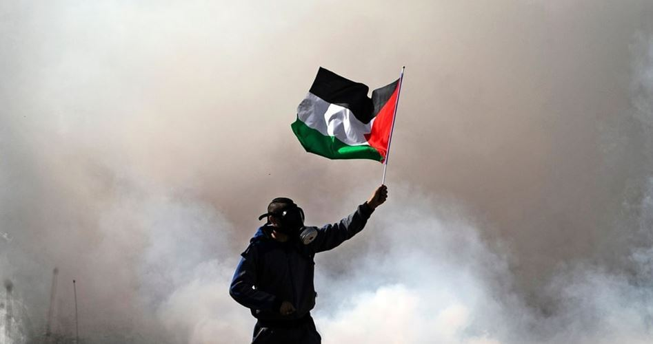
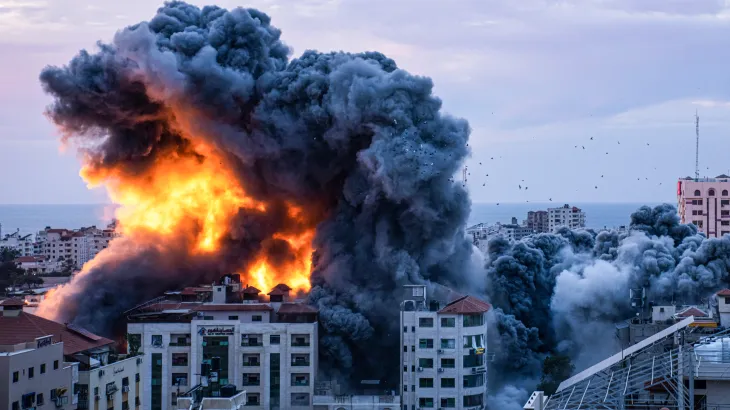

# AI Image Classifier | GazaUnderAttack

Image classification project with micro:bit | Gaza under attack

Test images for image classifier:

<picture>
  
</picture>

<picture>
  
</picture>

Watch the implementation of this code on our YouTube channel: https://www.youtube.com/@Roboticxps

To get your own micro:bit, visit our online store: https://roboticx.ps/

Follow us on social media:

* Facebook: https://www.facebook.com/Roboticxps
* Instagram: https://www.instagram.com/roboticx.ps/
* YouTube: https://www.youtube.com/@Roboticxps
